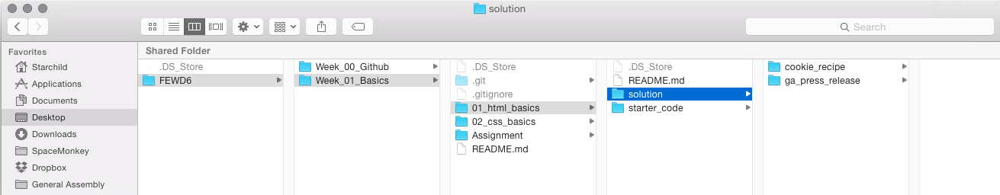

##FEWD GitHub Grading Workflow

##Student Submission

Students should submit homework via GitHub using the techniques taught in [this lesson](README.md)

* At the beginning of each new week you will navigate to [the class group page](https://github.com/GA-Chicago-FEWD6) and fork the corresponding week's repo. 
* After cloning your forked copy of the week's repo to your desktop you will be able to follow along with the week's materials and starter code
* When an assignment is given for that week you will add your own work in a folder with the project name (example: `/ga_press_release`), inside of a `/solution` folder in that lessons' folder, **so**, your folder structure will end up looking like this:

* When you are ready to submit your work, commit your changes and leave a commit message, and 'sync' your local repo to the remote fork on Github by clicking the "sync" button in the Github desktop application.
* Navigate to your remote forked repo that you just pushed changes to, and click on the green "New pull request" button.
* Make sure your work is all ready for review and then click on the green "Create pull request" button, review one last time, and then click the green "Create pull request" button again to finalize.
* I will be notified of the pull request and can then review your code and give you feedback

### Code Review

The most important part of the homework process is giving feedback on students' code quality and application of skills. We will use GitHub's in-line commenting system to share this feedback.

* For a particular homework / project, open up a student's repository
* Go to the "Commits" tab. Most students will have a single commit. If students have a couple commits, you may want to review multiple commits. 
* To provide your feedback, click on a commit
* Review the code and use GitHub in-line commenting for feedback. Aim to make at least 3 comments on every assignment: two things you liked - with one comment for each - and one comment where a line or block of code could be improved. Also, feel free to note any additional issues with their code using in-line comments. For students that are doing well this may be limited. However, for students who are struggling on a section, this is a great opportunity to reinforce solutions to issues: students tend to make the same mistakes throughout their codebase.
    - An example of a comment showing one thing you liked: "Your code is nicely commented!  I was easily able to follow what you were trying to do here."
    - An example of a comment showing one thing you *didn't* like: "You rewrote this anonymous function three different times.  Think about how could have declared a function and called that function in different places instead rewriting that script each time."
* Students will receive notifications of the feedback via GitHub.